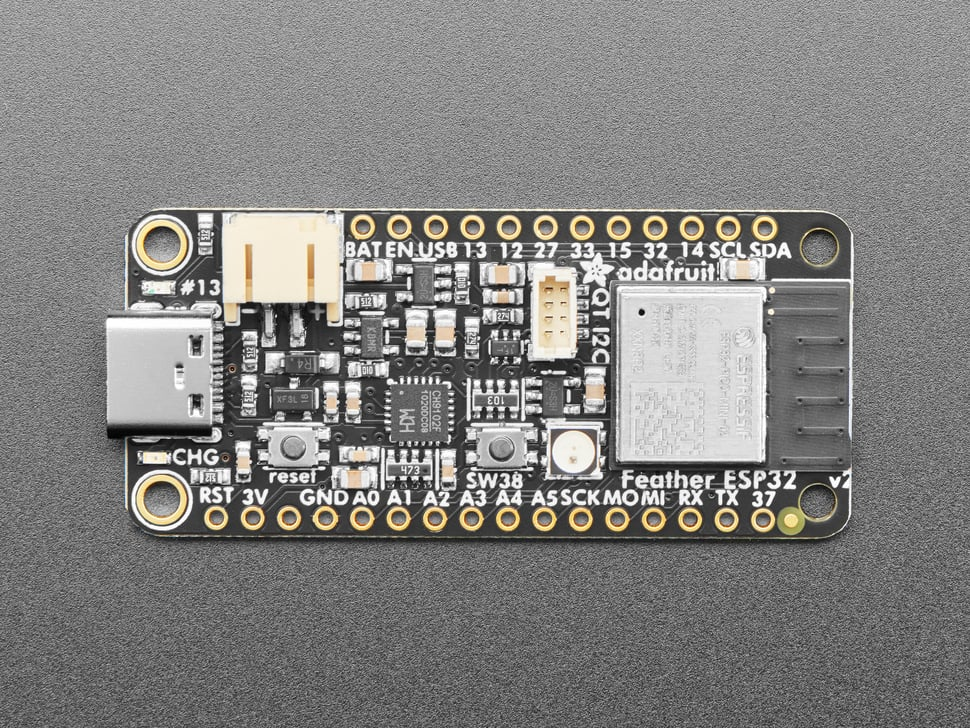

### TALOSv1

While there are an almost endless ways to configure, create and design a TALOS device some configurations just make more sense than others.
Currently as of v0.6.4-beta there is minimal support for a diverse architecture of TALOS devices but that is being worked on.
The device specifications here are for TALOSv1 devices and is the minimum requirements to be supported devices.

This device is supposed to last multiple months on charge and take a little time to recharge every now and then because some people don't like the way a device looks when continuously plugged in. 

### What Do I Need?

 #### Parts

 - [3D Printable Enclosure (for Waveshare 7.5in ePaper)](TALOSv1%20Enclosure.stl) (models in this directory)
 - [Waveshare 7.5in ePaper w/Hat](https://www.waveshare.com/7.5inch-e-Paper-HAT.htm)
 - [Adafruit ESP32 Feather V2](https://www.adafruit.com/product/5400) (You can future proof with the V2)
 - Type-C Port
   - [Simple and Cheap](https://www.amazon.com/OBVIS-Waterproof-Accessories-Converter-Motorcycle)
   - [Robust and Good Looking](https://www.amazon.com/QIANRENON-Rectangular-Connector-Mounting-Charging)
  - Battery (optional) 

 > **WARNING**: I don't feel comfortable recommending you buy any specific battery but if you are willing to check the voltages and ensure that the polarity is correct this looks like it will last for a long time. If the polarity is not correct you **WILL** destroy the charging circuity on this board. I have the experience destroying boards. Otherwise this project will function if you leave it plugged in. [Ensure you check its polarity.](https://www.amazon.com/Battery-10000mAh-Lithium-Rechargeable-Raspberry/dp/B093WS6C66)

 #### Tools
  - 3D Printer -> For creating the enclosure
  - Dremel -> For cutting holes for the type-c port and sanding
  - Sanding Tools (optional) -> To sand the enclosure before spraying or dipping in lacquer making the enclosure look better
  - Clear Lacquer (optional) -> After sanding spray or dip for a polished look
  - Soldering Iron -> For soldering the ePaper hat to the board
  - Volt Meter (optional) -> Checking polarities and other functionality

 ### Step 1 - Check Your Hardware
 
 After you have all your equipment it would be good to ensure that all of it is working and tested. Check and make sure that your ESP32 Feather is functional by either testing the preprogrammed led blinking sketch or by uploading and testing yourself.

 You can make sure that the Waveshare display works by just wiring everything up on a breadboard and going from there by uploading/running TALOSv1. If you don't feel like it and trust the process go right ahead and wire up the device using your soldering iron and test that way when we get down the line.

 ### Step 2 - Find Your Pins 

 Your pins for SPI are described on the board itself.
 Here on the Arduino ESP32 Feather V2 you can see SCK, MO, and MI on the bottom right of the GPIO pins.

 

 Some pins have different names here is a table that specifies SPI name conversions. If you are familiar with SPI you probably already know this but for those that don't:

 Peripheral In | Peripheral Out | Clock | Chip Select
 --- | --- | --- | ---
 CI | CO | SCK | CS
 MI | MO | SCK | SS
    |    | CLK | 

 These are typical SPI pin names that can be used interchangeably but typically you will only use one row.
 The implementation of TALOS uses controller name pins CI, CO, And CLK and CS so you'll have to use the conversion table.
